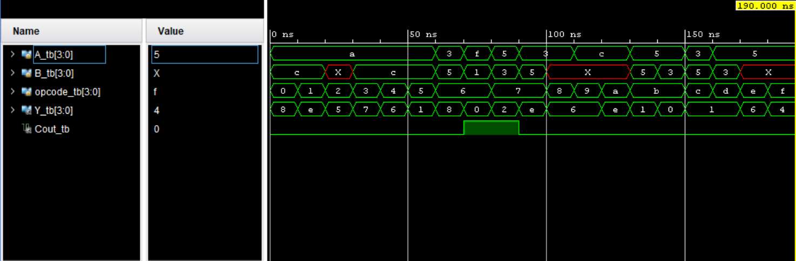
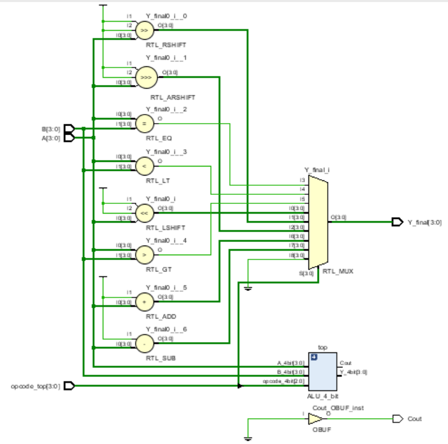
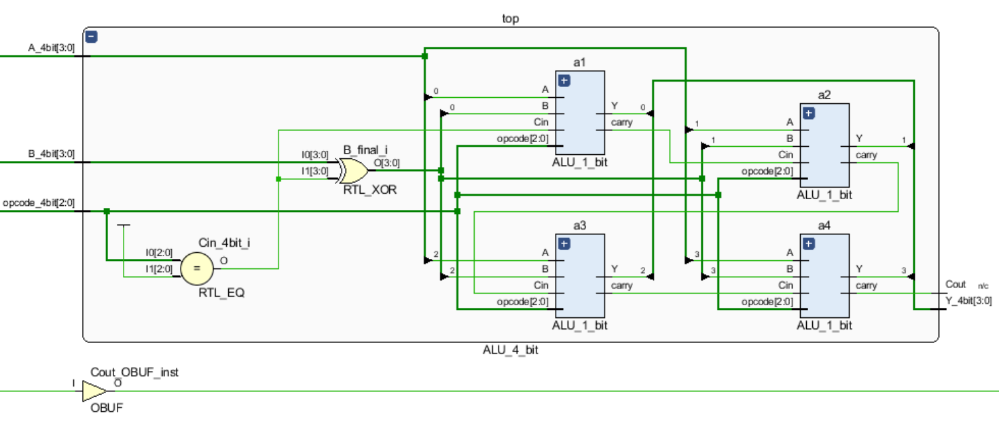
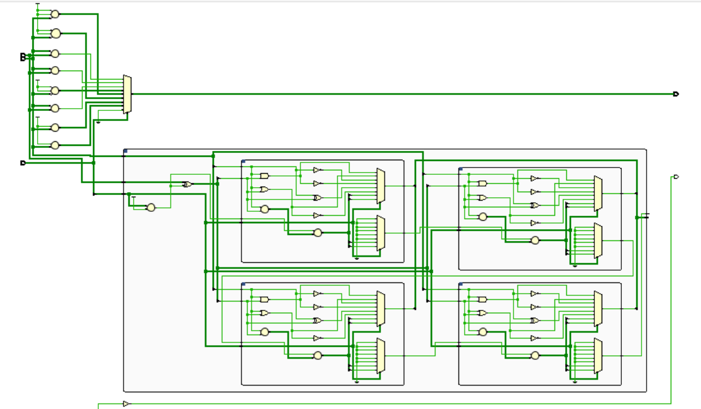

# 4-Bit ALU - Verilog Implementation

## 1. Overview
A 4-bit Arithmetic Logic Unit (ALU) designed in Verilog HDL using behavioral modeling. It implements a 16-operation instruction set including arithmetic, logical, shift, and comparison functions. Each operation is selected via a 4-bit opcode and verified through a structured testbench and waveform analysis in Xilinx Vivado.

Built as my first RTL design project, marking an important milestone in my VLSI and digital design learning journey.

## 2. Features
- Modular hierarchical design — `ALU_TOP` handles top-level control and multi-bit operations, `ALU_4_bit` instantiates the `ALU_1_bit` cells
- Operates on two 4-bit operands (`A` and `B`)
- Supports 16 operations selected via a 4-bit opcode
- Implements arithmetic, logical, shift, and comparison functions
- Generates Carry, Zero, Sign, and Overflow status flags
- Verified using a dedicated testbench and waveform analysis in Xilinx Vivado

## 3. Instruction Set Architecture (ISA)
Supports 16 operations via 4-bit opcode (Operation Code)
| Opcode | Operation | Description |
|:------------:|:---------------:|:-----------------:|
| 0000| AND | Bitwise AND of A and B|
| 0001| OR | Bitwise OR of A and B|
| 0010| NOT| Bitwise NOT of A|
| 0011| NAND | Bitwise NAND of A and B|
|0100| XOR | Bitwise XOR of A and B|
|0101| NOR | Bitwise NOR of A and B|
|0110| ADD| A + B|
|0111| SUB | A - B|
|1000| SLL | Shift Left Logical (for A)|
|1001| SRL| Shift Right Logical (for A)|
|1010| SRA| Shift Right Arithmetic (for A)|
|1011| SEQ| Set Equal to (A == B)|
|1100| SLT | Set Less Than (A < B)|
|1101| SGT| Set Greater Than (A > B)|
|1110| Increment | A + 1 |
|1111| Decrement | A - 1| 

## 4. Project Structure
```
4-bit-ALU/
├── src/
│   ├── ALU_1_bit.v
│   ├── ALU_4_bit.v
│   └── ALU_TOP.v
├── tb/
│   └── ALU_TOP_tb.v
├── docs/
│   ├── schematic.png
│   └── waveform.png
└── README.md
```
## 5. Simulation & RTL Schematic

### Waveform


### RTL Schematic 




## 6. Key Learnings
- Designed a hierarchical ALU architecture by reusing `ALU_1_bit` instead of directly adding all the operations in single `ALU_4_bit`.
- Implemented arithmetic operations using ripple-carry architecture.
- Implemented and verified ALU status flags: Carry (`C`), Zero (`Z`), Negative (`N`), and Overflow (`V`).
- Debugged subtraction (`SUB`) logic. Learned that operand inversion should be handled at the 4-bit datapath level rather than inside each 1-bit ALU cell. This made me realise the importance of separating control logic and datapath logic in hierarchical RTL design.
- Debugged a control-path issue in `ALU_TOP` where a default case unintentionally overrode valid outputs causing all operations (0000–0111) to result in zero.
- Learned to efficiently read simulation waveforms and debug design errors directly from signal behavior.
